# Medicament 
Your Medical Inventory Management System

A medical shop contains large amount of medicine spread across the store. It is difficult to not only track expiry of each product but also to check if a stock of medicine is available or not. Every year medical shop owners face huge amount of loss due to this infeasible way of handling them.

“Medicament”, an online medical inventory management system is developed with an aim to reduce the time and energy required to carry out day to day medical inventory management task in a medical shop. It provides an interactive dashboard that indicate the today’s total sale amount, transaction carried out today and total number of expiring medicines without any effort. The platform keeps a track of total stock of medicine available. It also provides a list of medicine that are expiring today. It automates the task of record maintenance in a pharmacy shop. This allows business owners to focus on strategies of market expansion and “medicament” will take of their inventory.


## Live Demo of project

https://medicament-test.azurewebsites.net


## Features

- Dashboard providing basic Stats
- Total Medicine available
- List of Medicine expiring today
- Today's Total Transaction
- Total sale amount and Record Maintainance   


## Use Of Azure Services In Project

- Azure Cosmos DB
    : Azure cosmos dB is used as database for my web app. The Application talks to the database on cloud (Azure cosmos DB) In order to provide functionality mentioned under the features section. Screenshot below gives shows information about Database employeed in project on my azure portal.
    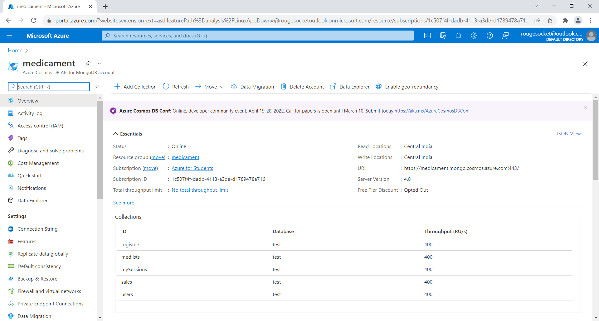
- Azure APP Services: This Azure service is used for deployment of the project from my machine onto azure. The live link of the project can be found [here](https://medicament-test.azurewebsites.net/)
- Visual Studio Code : Entire development as well as testing is done on Visual Studio Code.


## Screenshots
- When you visit the live link in your favorite browser. you can see the index page of the web app. To create an account click on sign up. 
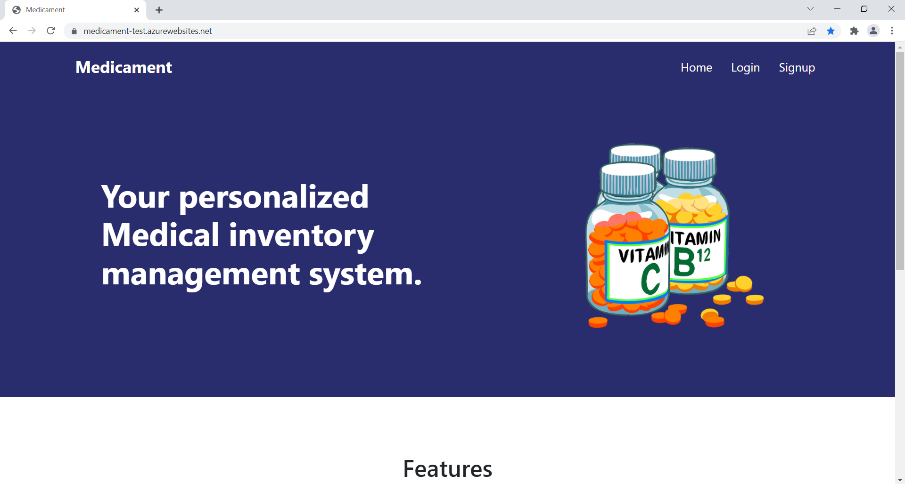
- Fill in the basic detail asked by the app. Click on Sign up.
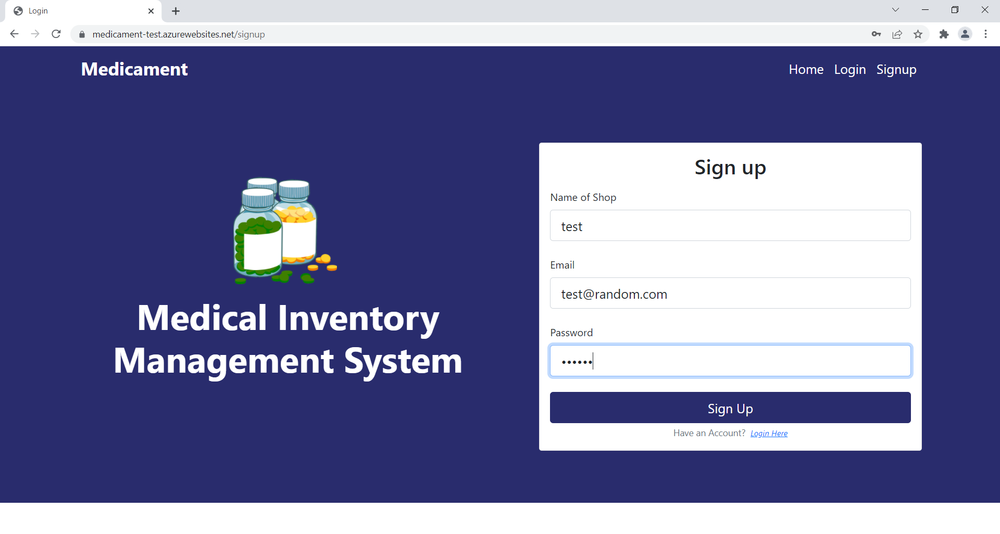
- if your details are correct you will be greeted with a message that your account has been created successfully.
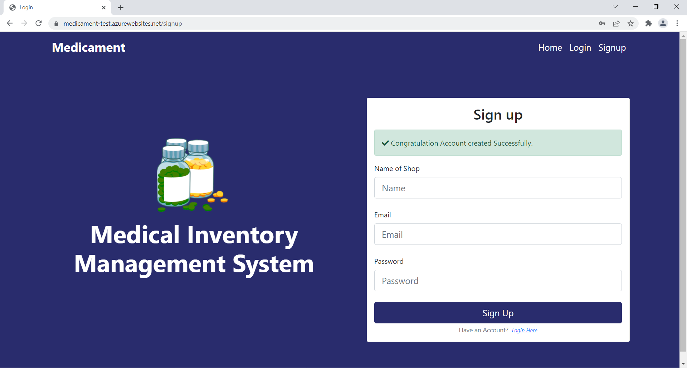
- Click On login and Fill your details.
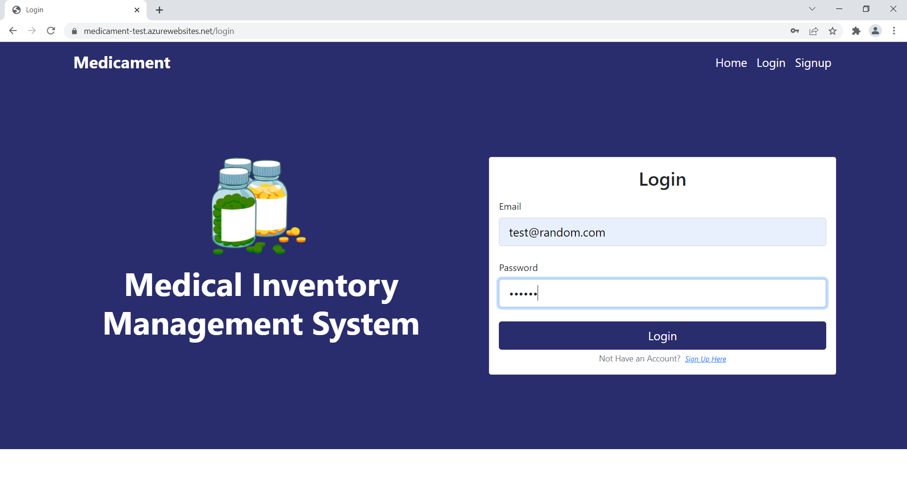
- if details are correct you will be redirected to dashboard. Since this a new account you do not have anything so everything is "0" over here.

- you can add medicine by going onto medicine list in dashboard navigation. Intially it is empty.
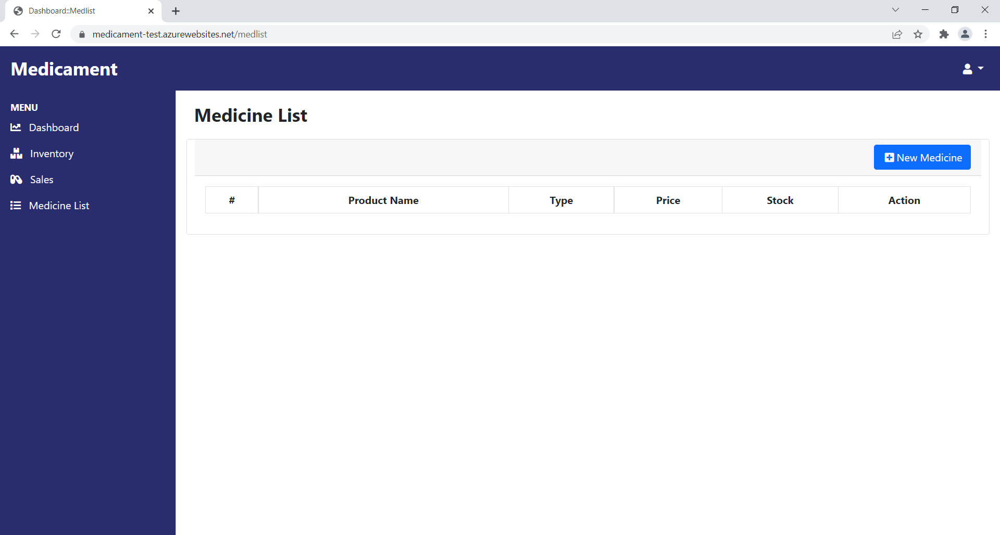
click on new medicine button on top of the table. Add Data as per stocks available and add them by clicking on submit.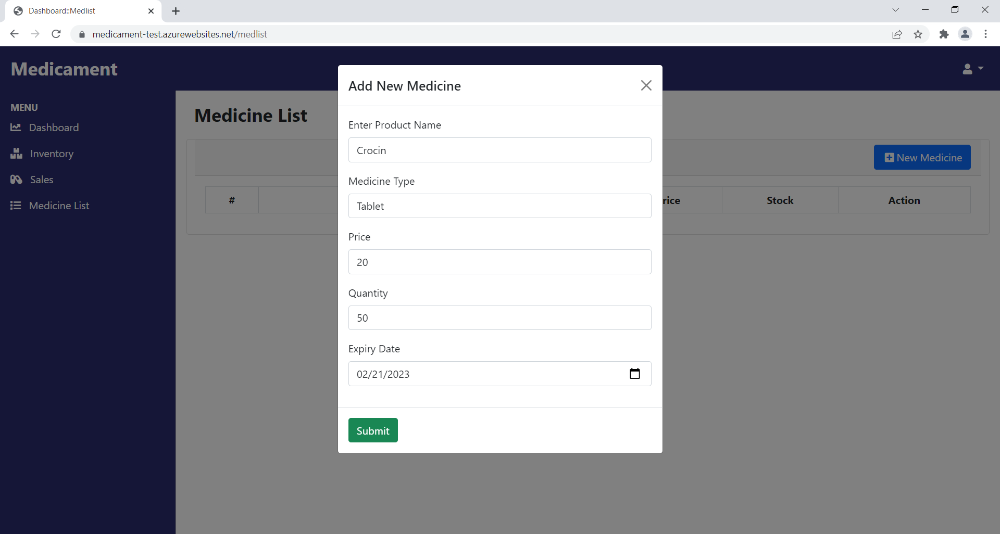
The medicine is added and is listed under medicine list and can also be found under inventory in dashboard navigation.
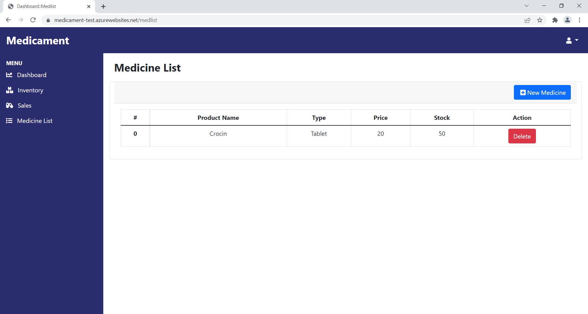
Adding Some more medicine
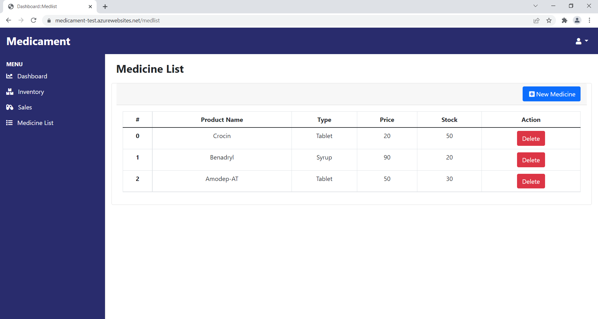
- When you navigate to Inventory you can see all added medicine with their expiry.
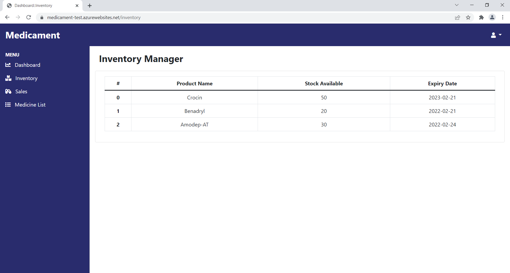
- When you click on dashboard you can see expiring medicine count and their list.

- When you click on sales you can add name of product and its quantity by click on new sale. It will automatically be added to list and dashboard will be updated accordingly.
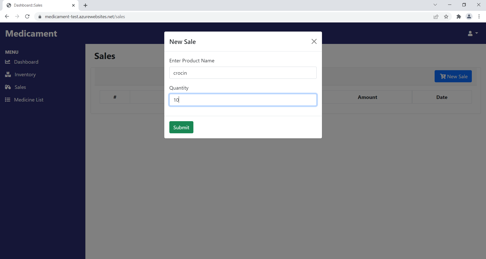
After adding more sales the sales page looks like this.
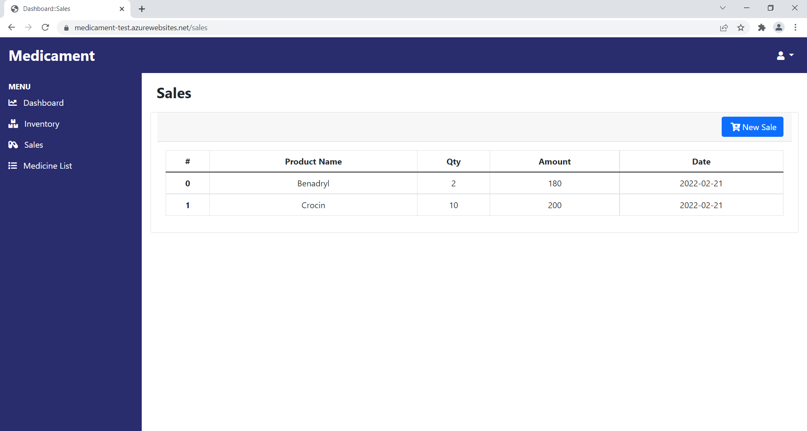
- Finally updated dashboard shows the number of transaction as well as total sale amouont.
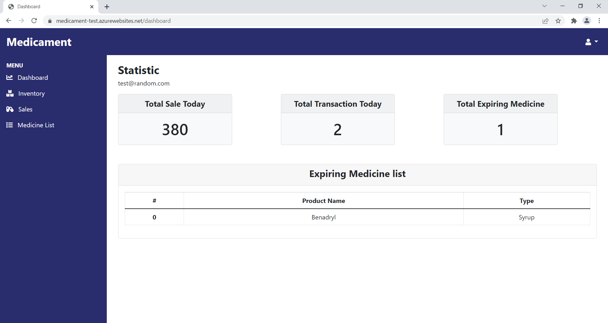
- When you click on top right user icon you will get option to logout 
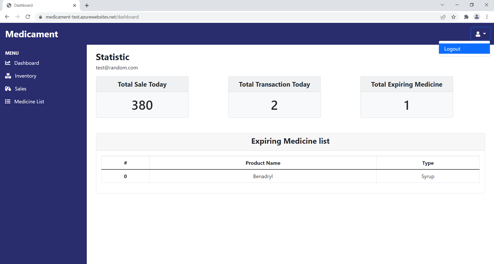
- After that you will be redirected to Homepage


## Run Locally

Clone the project

```bash
  git clone https://github.com/rougesocket/medicament.git
```

Go to the project directory

```bash
  cd medicament
```

Install dependencies

```bash
  npm install
```

Run the server

```bash
  node app.js
```

